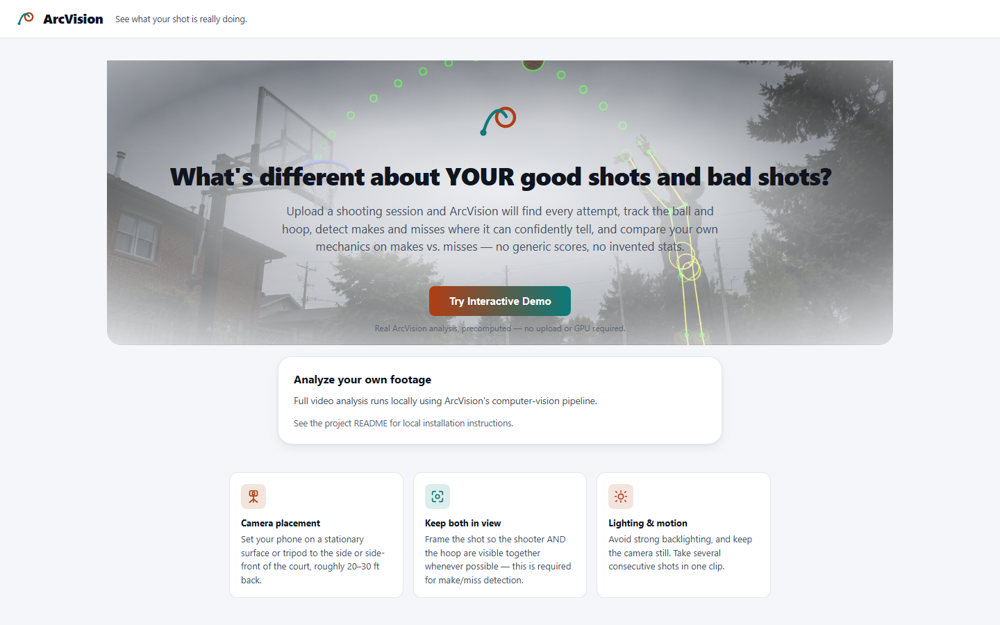
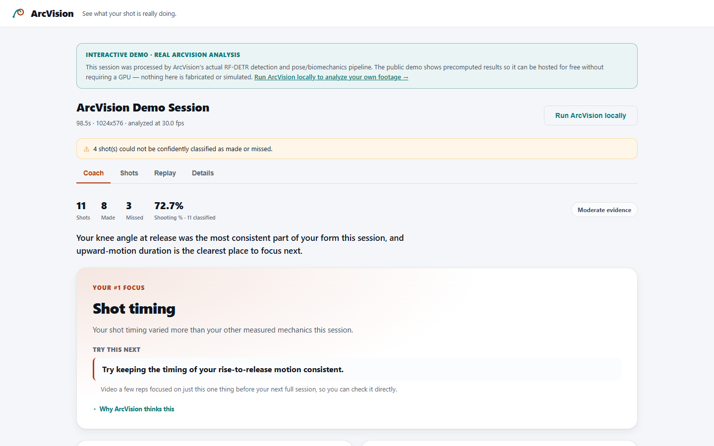
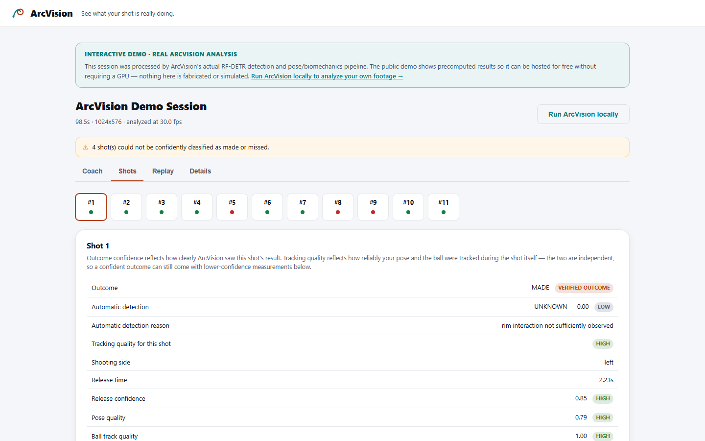
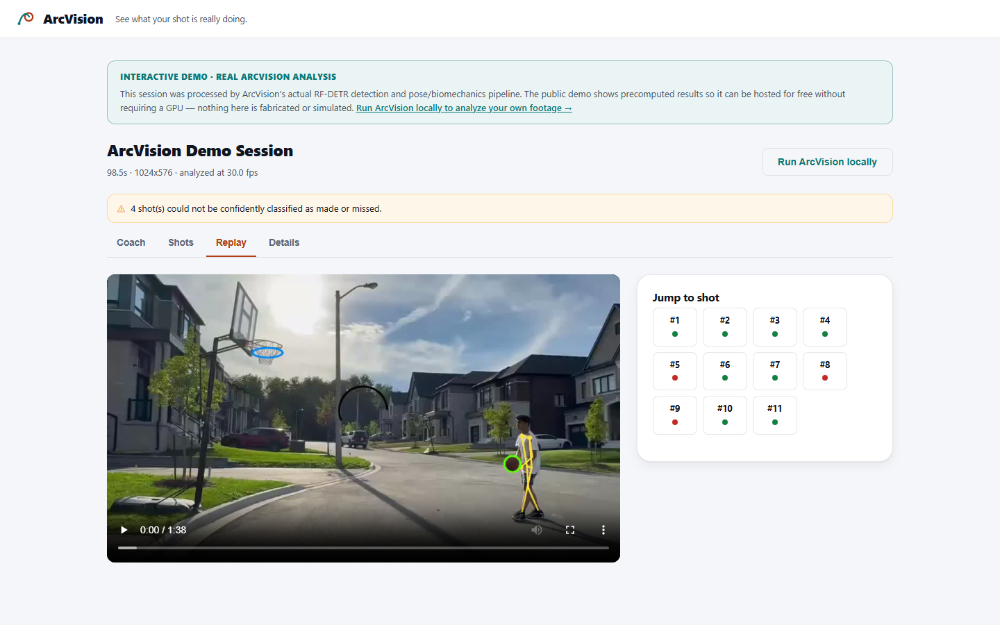
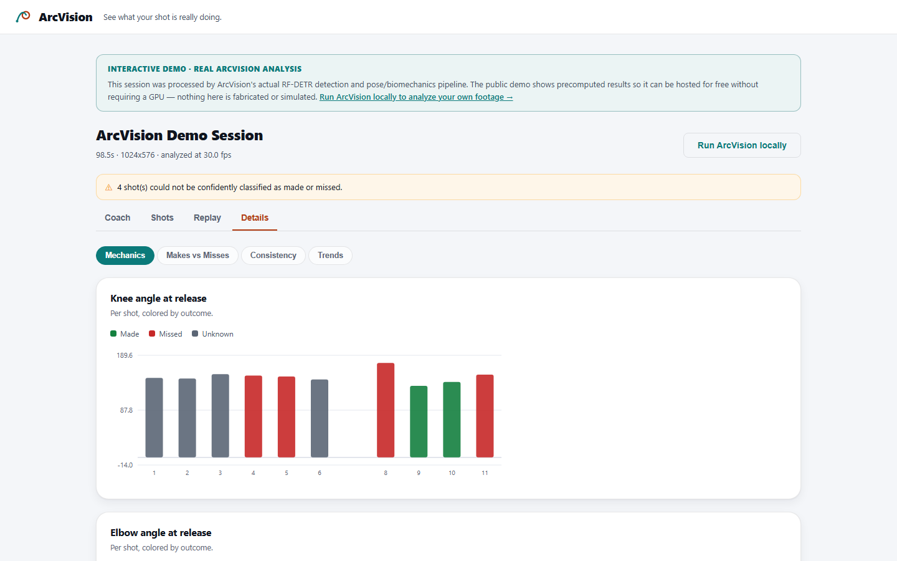

# ArcVision

A computer-vision basketball shot analysis tool that answers one question: **what's
different about *your* good shots and *your* bad shots?**

Upload a shooting session, and ArcVision automatically finds every shot attempt, tracks the
shooter's pose, the basketball, and the hoop, detects each release, classifies makes/misses
where the evidence is strong enough, measures shooting mechanics, and compares your own makes
to your own misses to surface real, measured patterns — not a generic "form score."

Running ArcVision on your own footage happens **entirely locally** — no video is ever uploaded
to any third-party service. The public demo described below is a separate, static, read-only
showcase of one already-analyzed session; it never accepts an upload either.

**Built with:** a basketball-specific object detector ([RF-DETR](https://github.com/roboflow/rf-detr),
fine-tuned on 9,612 labeled frames), MediaPipe pose estimation, a custom Kalman tracker, and an
explicit finite-state-machine shot segmenter feeding a phase-based (not single-frame) make/miss
classifier — FastAPI backend, build-tool-free vanilla-JS frontend. What makes it more than a
model wrapper: the detector was benchmarked against the generic COCO stack it replaced (near-rim
ball coverage ~0% → ~90%+), and the whole frozen architecture was then blind-tested against a
video with zero influence on its own development — including reporting where that test failed
rather than quietly re-tuning to pass it (see "Evaluation & Limitations" below).

## Try it

- **[Public interactive demo](https://rish-mishra.github.io/ArcVision/)**. Click through a real, already-analyzed
  session — Coach, Shots, Replay, and Details are all fully interactive — with no install, no
  GPU, and no upload. It's a genuine ArcVision output (the real RF-DETR + pose + biomechanics
  pipeline, run once, ahead of time), not sample or fabricated data. Hosted for $0 as a static
  site precisely *because* it's precomputed — see the note in the demo itself for exactly what
  that means.
- **Full local application** — clone this repo and analyze your own footage with the real,
  live pipeline. See "Windows installation" below.

| | Public demo | Local application |
|---|---|---|
| What it shows | One real, precomputed ArcVision session | Your own video, analyzed live |
| Upload | Not available (static hosting, no backend) | Full upload → analysis → results |
| Cost to run | $0, nothing to install | Free, but needs Python and this repo locally |
| RF-DETR / GPU | Not needed — nothing runs live | Runs the real fine-tuned detector |

## What this is not

- Not a pose-overlay demo — pose is one input to a full make/miss + mechanics pipeline.
- Not a "your shot scored 87/100" gimmick — there is no invented composite score.
- Not a claim that every player should have identical mechanics — the whole point is
  comparing you to yourself.
- Not a system that pretends to know things it can't measure. When detection confidence is
  too low, the dashboard says "unable to determine reliably" instead of guessing.

See `docs/METHODOLOGY.md` for exactly how every number is computed, its coordinate system
(image-space / body-relative / angular — never a fabricated physical unit), and its
limitations. See "Evaluation & Limitations" below for how this pipeline actually performed on
a video with no influence over its own development.

## Screenshots

All captured from the real, precomputed public demo session — not sample or fabricated data.







## Recommended recording setup (V1)

- One shooter, one ball, one hoop, mostly-stationary camera (a phone propped up or on a
  tripod — no panning/handheld walking).
- Side, diagonal, or side-front angle, far enough back that the shooter's full body and the
  hoop are both visible.
- Avoid strong backlighting (don't shoot directly into a window/sun behind the player).
- Record several consecutive shot attempts in one clip (10+ recommended — makes-vs-misses
  and trend analysis need enough shots to say anything meaningful).
- MP4 or MOV, 1.5–300 seconds, up to 500MB.

## Architecture

```
VIDEO INPUT → VALIDATION → PERSON/POSE → BALL DETECTION → HOOP DETECTION → TRACKING
  → SHOT SEGMENTATION → RELEASE DETECTION → OUTCOME DETECTION → BIOMECHANICS
  → SESSION ANALYTICS (consistency / makes-vs-misses / trends / feedback)
  → ANNOTATED VIDEO → WEB DASHBOARD
```

| Layer | Location | Approach |
|---|---|---|
| Config | `app/config.py` | Every threshold in the pipeline, centralized and documented — no scattered magic numbers. |
| Video I/O | `app/pipeline/video_io.py` | Validation, resolution/fps-reduced frame reading for analysis speed, browser-safe H.264 re-encoding via bundled ffmpeg. |
| Person detection | `app/vision/detection/yolo_detector.py`, `person_selector.py` | YOLOv8n (COCO), primary-shooter selection by size/temporal consistency. |
| Pose estimation | `app/vision/pose/pose_estimator.py` | MediaPipe BlazePose, run on the shooter's crop, with light smoothing that's frozen around release. |
| Ball + rim detection | `app/vision/detection/ball_rim_detector_rfdetr.py` | **Primary:** RF-DETR-Small, fine-tuned specifically for basketball/rim (see "Basketball-specific detector" below). One model call yields both classes. |
| Ball + hoop detection (fallback) | `ball_detector.py`, `ball_detector_learned.py`, `hoop_detector.py`, `hoop_detector_learned.py`, `tracking/hoop_aggregator.py` | Automatic fallback if the fine-tuned checkpoint is unavailable: YOLOv8n "sports ball" + color/circularity validation, YOLO-World open-vocabulary prompts, classical color/Hough hoop detection — aggregated across frames for a static camera. |
| Tracking | `app/tracking/kalman_tracker.py`, `ball_tracker.py` | Custom constant-velocity Kalman filter; explicit detected/interpolated/predicted/unavailable provenance. |
| Shot segmentation | `app/events/shot_state_machine.py` | Explicit finite-state machine (LOAD→UPWARD→RELEASED→FLIGHT), not a single-signal heuristic. |
| Release detection | `app/events/release_detector.py` | Refines the state machine's candidate using hand-ball distance, velocity, elbow extension. |
| Outcome detection | `app/events/outcome_detector.py` | Directionally-ordered ball/rim-band crossing, not single-frame overlap. |
| Biomechanics | `app/biomechanics/` | Joint angles, body-relative distances, timing. |
| Analytics | `app/analytics/` | Shot records, consistency, makes-vs-misses, trends, evidence-based feedback. |
| Annotation | `app/annotation/` | Clean replay overlay + separate diagnostic/debug overlay. |
| Storage | `app/storage/` | SQLite, session + shot records. |
| API | `app/api/`, `app/main.py` | FastAPI. |
| Frontend | `frontend/` | Vanilla HTML/CSS/JS single-page dashboard (no Node/build step required). |

### Why these specific models/libraries

- **MediaPipe Pose (BlazePose)** — Apache-2.0, fast on CPU, well-validated, gives all the
  joints needed (shoulders/elbows/wrists/hips/knees/ankles) without needing a GPU.
- **YOLOv8n (Ultralytics, COCO-pretrained)** — used for person detection directly, and as a
  base "sports ball" candidate detector for basketballs. GPU-accelerated on this machine
  (CUDA-enabled PyTorch) when available, CPU fallback otherwise. *License note:* Ultralytics
  is AGPL-3.0. For this local, single-user, non-distributed tool that's a non-issue in
  practice; a future commercial/hosted deployment would need re-licensing (Ultralytics
  Enterprise) or a different detector implementation.
- **No pretrained hoop/rim model** — none exists in COCO, and pulling an unverified
  community-trained weights file is both a license-provenance risk and unavailable if this
  machine is offline. V1 uses classical, inspectable computer vision (color mask + Hough/contour
  circles) behind a replaceable detector interface. *Update after the first real-video
  calibration:* a real hoop's dark, weathered rim produced zero color-mask pixels for an entire
  session, so **YOLO-World** (Ultralytics' open-vocabulary detector, official pretrained
  weights from the same trusted release channel as `yolov8n.pt`) was added as a second
  candidate source, prompted directly as "basketball hoop/rim/backboard/net" — no color
  assumption, confirmed working on that video. The same model, prompted as "basketball", was
  also added as a second basketball-candidate source after COCO's generic "sports ball" class
  turned out to have poor recall (<10%) for a real, often hand-occluded ball; the open-vocabulary
  prompt roughly quadrupled that. Both stay swappable independently behind the same
  candidate-source interface.
- **Custom Kalman tracker** instead of ByteTrack/BoT-SORT — the tracking problem here is
  narrow (one ball, one hoop), so a small, fully-understood, dependency-free tracker was
  chosen over a heavier multi-object tracking library.
- **SQLite** (stdlib `sqlite3`) — no server process, no extra dependency, appropriate for a
  local single-user app.
- **Vanilla JS frontend** — this machine has no Node.js/npm installed; a build-tool-free
  frontend keeps the whole project runnable with just Python.

## Basketball-specific detector (RF-DETR)

The generic detector stack above was V1's necessary starting point (COCO has no basketball/rim
classes), but real-footage benchmarking found it recalled the ball in only 23% of frames
overall and essentially never near the rim — exactly where make/miss detection needs evidence
most. It was replaced as the **primary** ball/rim source by a basketball-specific detector:

- **Model**: [RF-DETR-Small](https://github.com/roboflow/rf-detr) (Roboflow, Apache-2.0),
  fine-tuned from its COCO-pretrained checkpoint.
- **Dataset**: University of Arizona ["Basketball Shooting
  Robot"](https://universe.roboflow.com/the-university-of-arizona-th1yv/basketball-shooting-robot)
  (Roboflow Universe), **CC BY 4.0**. 9,612 images / 17,258 boxes, `ball` + `rim` classes.
- **Result** (A/B benchmarked against the full generic stack on real footage, not just
  validation metrics): near-rim ball detection coverage went from ~0% to ~90%+ of frames, rim
  positional stability improved ~6.6×, and it's *faster* (38.9 vs 28.0 fps) despite replacing
  four model calls with one.
- **Runs 100% locally** — the fine-tuned checkpoint (`models/rfdetr_ball_rim_v1.pth`) is loaded
  from disk; no network calls at inference time. Training required a one-time Roboflow API key
  (stored in a gitignored `.env`, never logged) to fetch the training data; nothing about
  running the app or analyzing videos needs one.
- **Not deleted**: the generic stack remains as an automatic fallback if the fine-tuned
  checkpoint is missing, plus standalone diagnostic tooling
  (`scripts/benchmark_ball_rim_detectors.py`, `scripts/visual_benchmark_frames.py`).

Full training procedure, metrics, benchmark methodology/results, and retraining instructions:
see `docs/METHODOLOGY.md` → "Detector architecture."

## Windows installation

Requires [Python 3.11](https://www.python.org/downloads/) (installed with the "py launcher" /
"Add python.exe to PATH" option enabled, so the `py -3.11` command works) and Git.

```powershell
.\scripts\setup_env.ps1
```

This creates an isolated `.venv`, installs CUDA-enabled PyTorch first (falls back to CPU
automatically if no compatible GPU/driver is present), installs the rest of the
dependencies, and downloads the YOLOv8n/YOLO-World base weights.

**Note on the fine-tuned detector checkpoint:** `models/rfdetr_ball_rim_v1.pth` (the
basketball-specific RF-DETR model described below, ~127MB) is not included in this
repository — it's gitignored along with everything else under `models/` and `data/`. Without
it, the app still runs, but automatically falls back to the generic YOLOv8/YOLO-World/
classical-CV detector stack (see "Ball + hoop detection (fallback)" below), which is
noticeably weaker near the rim. Download it from the
[`model-v1` release](https://github.com/rish-mishra/ArcVision/releases/tag/model-v1) and place
it at `models/rfdetr_ball_rim_v1.pth`, or see `docs/METHODOLOGY.md` → "Retraining / replacing
the model" to reproduce it yourself.

## Running the app

```powershell
.\run.ps1
```

Then open **http://127.0.0.1:8800** in a browser.

## Running tests

```powershell
.venv\Scripts\python.exe -m pytest tests/ -q
```

Test coverage includes: geometry (angles/distances/straightness), the Kalman tracker and
hoop aggregator (gap bridging, implausible-jump rejection, confidence clustering), the shot
state machine (legitimate shot / dribble / pass / incomplete attempt / duplicate-detection /
consecutive shots — all as synthetic frame-signal sequences), release detection, outcome
detection (clean make / rim miss / airball / insufficient evidence / predicted-only points),
biomechanics metrics, session analytics (consistency / makes-vs-misses / trends / feedback,
including minimum-sample-size gating), a full synthetic end-to-end integration test that
exercises everything downstream of detection with two fabricated shots (one made, one
missed), API tests (upload validation, job lifecycle, error handling) including one real
end-to-end run of the actual CV models against a tiny synthetic video, the RF-DETR ball/rim
detector adapter (class mapping, coordinate conversion, missing-checkpoint hard-fail), the
orchestrator's RF-DETR-primary/generic-stack-fallback branch selection, and the rim-based
physical-unit calibration (defensible-vs-refused cases), and regression coverage for the
NaN/Infinity export guard, the dashboard tab-switching scope fix, and the verified-demo outcome
presentation (global-warning suppression, primary/secondary hierarchy, normal-mode behavior
unchanged), the collapsed-by-default verified-demo measurement-notes presentation (with
fatal/excluded shots always staying expanded, and normal-mode ordering/behavior unchanged), and
the verified-outcome chart coloring/legend fix (Details charts follow the same display-outcome
helper as the rest of the app instead of leaking the raw automatic outcome), and the
missing-measurement chart footnote (shown only when a metric genuinely omits a shot).
**265 tests passing.**
(Some of these
cover shadow-mode research modules that were evaluated and never wired into production — see
"Evaluation & Limitations" below for which is which.)

## Diagnosing a real video

```powershell
.venv\Scripts\python.exe scripts\diagnose_video.py path\to\your_video.mp4
```

Produces (in `data/diagnostics/<video-name>/`): the full structured pipeline output as JSON,
a frame-by-frame CSV trace (pose confidence, ball position/source/confidence), diagnostic
plots (ball trajectory with shot windows shaded, pose confidence over time), and a debug
overlay video showing raw per-joint visibility, ball detection provenance/confidence, hoop
aggregation confidence, and per-shot state. Use this — not blind threshold-tweaking — when a
real shot is mis-segmented or misclassified.

## Project structure

```
app/
  config.py, logging_config.py, main.py
  api/            FastAPI routes
  pipeline/       video I/O, orchestrator, background job manager
  vision/         pose estimation, person/ball/hoop detection, shared types
  tracking/       Kalman filter, ball tracker, hoop aggregator
  events/         shot state machine, release detection, outcome detection
  biomechanics/   geometry, per-shot metrics, shooting-side detection
  analytics/      shot records, consistency, makes-vs-misses, trends, feedback
  annotation/     clean + diagnostic video renderers
  storage/        SQLite schema, repository, JSON serializers
frontend/         static HTML/CSS/JS dashboard
tests/            pytest suite (unit + synthetic integration + API)
scripts/          setup, model download, dataset prep/training/benchmarking, video diagnostics
docs/             methodology, frozen-architecture decision, Video 4 evaluation/forensic
                  reports, screenshots
models/           downloaded/fine-tuned weights, incl. rfdetr_ball_rim_v1.pth (gitignored)
data/             uploads, per-session outputs, SQLite DB, logs, datasets, training runs (all gitignored)
```

## Real-footage calibration status

The first real test video (`real_test_01`, a residential driveway hoop, ~52s, one shooter)
surfaced and led to fixing four real bugs, each with regression tests:

1. **Hoop detection failed completely** — the classical color-mask detector assumes a
   bright-orange rim; this rim was dark, weathered metal against a bright sky, producing zero
   color-mask pixels for the whole session. Fixed by adding YOLO-World (open-vocabulary,
   prompted as "basketball hoop/rim/backboard/net") as a second candidate source, and by fixing
   a real bug in the cross-frame aggregator that counted raw candidate boxes rather than
   distinct frames as "votes" (letting a moving false positive nearly outscore the true,
   repeatedly-observed hoop). **Confirmed working** on the real video with no manual coordinates.
2. **Basketball detection recall was ~3%** — COCO's generic "sports ball" class barely detects
   a real, often hand-occluded ball at typical recreational-court distance. Fixed by adding
   YOLO-World prompted as "basketball" as a second candidate source (recall roughly
   quadrupled). Still has a real, unresolved gap immediately around the hoop/backboard
   (motion blur + visual clutter) — see Known Limitations in the methodology doc.
3. **The shot state machine required continuous ball-hand tracking to ever start a shot** —
   fragile given (2). Fixed with a fallback trigger that recognizes a confirmed upward ball
   flight as a release-in-progress on its own, reconstructing the load phase from pose alone.
4. **Flight windows closed prematurely** — "ball not detected" was being treated as "ball
   retrieved," closing shot windows before the ball had traveled anywhere near the hoop. Fixed
   with a confirmed-vs-unresolved distinction and a physically-motivated blackout budget.

**Resolved in a later pass:** the outcome detector's original MISS branch didn't verify a genuine
apex-then-descent pattern and could be satisfied by an ordinary post-catch ball position; every
shot on the real video used to resolve to it with an identical confidence. `app/events/outcome_detector.py`
was fully redesigned around explicit phase reasoning (RELEASE→ASCENT→APEX→DESCENT→HOOP
APPROACH→RIM INTERACTION→POST-RIM MOTION) requiring positive evidence for both MADE and MISSED,
with UNKNOWN as a first-class outcome rather than a fallback to minimize — see
`docs/METHODOLOGY.md` → "Make / miss / unknown."

**Second calibration pass — shot-segmentation false positives.** With the ground truth that the
real video contained exactly 7 shot attempts, the pipeline's 9 detections were traced frame by
frame (`scripts/shot_timeline_debug.py`) and matched against the real footage. Both extra
detections turned out to share the root cause above: "ball moving up fast" is not a shot
signature on its own, and neither is "the ball moved up AND the knee bent" —

- **False positive #1: a rim rebound.** After a miss, the ball bounced back upward past
  shoulder height while the shooter stood still watching it -- exactly the fallback trigger's
  signature, with no real load. It passed a first knee-flexion-drop fix because the lookback
  window reached back far enough to "borrow" the *previous* shot's own genuine dip. Fixed by
  bounding the lookback to never cross into the previous shot's window.
- **False positive #2: a different player dribbling while walking toward the hoop.** Ordinary
  gait produced a *real* (not noise) knee-flexion dip large enough to pass the fix above on its
  own. What actually distinguished it from every genuine shot checked was gross horizontal hip
  translation (walking across most of the frame vs. a fraction of one torso-length for every
  real shot) -- shooting is done from a stationary base. Fixed by adding that as an additional,
  independent requirement.

A related, secondary finding: pose estimation produced a couple of isolated ~50-80° knee-angle
readings during a moment two people's poses overlapped in frame -- almost certainly noise, not a
real squat -- which was enough to spuriously satisfy the flexion-drop check on its own before a
biomechanical plausibility floor was added to filter it.

**Result: exactly 7 shots detected, and all 7 release timestamps were independently verified by
eye against the source video** (release frames were pulled and visually inspected one by one --
see the session transcript, not merely re-derived from the target count). Nine new regression
tests cover these exact failure modes (rebound, walking dribble, catch-after-miss, intermittent
detection, predicted-only ball motion, temporary false detection, duplicate release candidates,
raising the ball without shooting, consecutive real shots around a rebound) plus the four from
the first pass; 74/74 automated tests pass **at this point in the project's history** (218
pass today — see "Running tests" above; the rest were added by later work below).

**Third calibration pass — basketball-specific detector upgrade.** Full A/B benchmark of a
fine-tuned RF-DETR detector against the generic YOLOv8/YOLO-World/classical-CV stack (see
"Basketball-specific detector" above and `docs/METHODOLOGY.md` → "Detector architecture" for
the complete story). Re-running the real video with the new detector as primary initially
produced 8 shots instead of the validated 7 — investigated, not tuned around: a genuine,
previously-latent bug in the shot state machine's knee-flexion-drop check (`app/events/shot_state_machine.py`),
which only checked the RANGE of knee angle in a lookback window with no regard for direction.
The video's own first frames caught the shooter mid-motion, knees already bent, simply
straightening as they picked up the ball — a large range, but running backwards, not a real
shooting load. This was invisible under the old, sparser detector and became reachable once
denser tracking made the trigger fire more reliably. Fixed by requiring the window's minimum
to have a genuinely higher, extended value strictly *before* it; re-verified result: 7 shots,
release timestamps within ~1s of the original detector stack's. Also added: a rough,
rim-depth-only ball-speed estimate for MADE shots using the regulation rim's known 18in inner
diameter as a single calibration reference (see `docs/METHODOLOGY.md` → "Physical-unit
calibration" for exactly what is and is not defensible from a single reference).

Recording guidance for further calibration clips remains: phone on a tripod or stable surface,
15–25 feet from the hoop at a side/side-front angle, shooter and hoop both in frame the whole
time, 8–15 consecutive shots (mix of makes and misses), normal lighting, 20–60 seconds. Run
`scripts/diagnose_video.py` against any new clip and treat mismatches as concrete bugs to fix
with a regression test, not a reason to blindly retune thresholds. RF-DETR was benchmarked on
one real video from one camera/lighting setup — re-run `scripts/benchmark_ball_rim_detectors.py`
and `scripts/visual_benchmark_frames.py` against any materially different footage (indoor gym,
different rim/net design, different camera angle) before trusting its results there.

## Evaluation & Limitations

The computer-vision architecture above — RF-DETR v1 detector, Kalman tracking, the shot
state machine, and the phase-based outcome detector — is **frozen** for this portfolio
version. It was iterated against the three real calibration videos described above, then
locked, then tested exactly once against a fourth video (`real_test_04`) that had zero
influence on any development decision: ground truth (18 shots, hand-logged outcomes and
timestamps) was written down and committed to this repo's git history *before* the pipeline
ever ran on the video, so the test couldn't be quietly re-graded after the fact. The full
protocol is [`docs/VIDEO4_EVALUATION_PROTOCOL.md`](docs/VIDEO4_EVALUATION_PROTOCOL.md).

**The blind test failed its pre-committed criteria.** That's reported here rather than
patched away — see [`docs/FINAL_ARCHITECTURE_DECISION.md`](docs/FINAL_ARCHITECTURE_DECISION.md)
for why "stop and document" was the deliberate decision, not a shortcut. Different parts of
the system behaved very differently on this new video, and collapsing that into one
"accuracy" figure would misrepresent it:

| Component | Result on the blind test (18 real shots: 7 made / 11 missed) |
|---|---|
| Ball/rim detector (raw frame coverage) | 85.5% ball, 100% rim — matches or exceeds the original benchmark (80.8% / 99.4%) |
| Shot detection (recall) | 18/18 real shots matched — no misses |
| Shot detection (false positives) | 5 extra detections (dribbles/walking briefly mistaken for shot attempts) |
| Release timing | mean error 0.36s, max 1.2s vs. hand-logged ground truth — accurate |
| Make/miss classification | **failed** — only 8 of 12 (66.7%) confident calls were correct; the other 6 of 18 shots correctly abstained as UNKNOWN rather than guessing |

The detector and shot-finding logic generalized well to new footage. The failure is specific
to make/miss classification, and it wasn't left unexplained: a frame-by-frame forensic pass
([`docs/VIDEO4_FORENSIC_ANALYSIS.md`](docs/VIDEO4_FORENSIC_ANALYSIS.md)) traced it to the
outcome detector's rim-crossing evidence checks, whose exact numeric tolerances were fitted
from specific percentages observed on the three calibration videos and don't generalize to
this video's different camera angle — three genuine makes were called misses because the
ball's clean, centered descent through the rim drifted further, or dipped in tracked
confidence less, than any make in the calibration data did.

**Why this isn't patched:** loosening those same tolerances to pass this video would directly
undo the protection they currently provide against a different failure (mistaking a
deflection or airball for a make) on the three videos already validated — a trade, not a free
fix — and judging whether a change actually helps would need a fifth video. Consistent with
the discipline used throughout this project's development, the decision was to document the
limitation rather than re-tune the architecture against one more data point. See
[`docs/FINAL_ARCHITECTURE_DECISION.md`](docs/FINAL_ARCHITECTURE_DECISION.md) for the full
verdict, which experimental modules (an alternate possession-based shot detector, a
trajectory-primary architecture, hard-negative detector fine-tunes) were evaluated and
deliberately left out of production, and [`docs/METHODOLOGY.md`](docs/METHODOLOGY.md) →
"Known limitations" for how this fits with the system's other documented limits.

## Licensing

- **ArcVision's own source code** — everything under `app/`, `frontend/`, `scripts/`, and
  `tests/` in this repository — is released under the [MIT License](LICENSE).
- **This MIT license covers ArcVision's own code only.** It does not extend to, replace, or
  relicense any third-party software, models, datasets, or assets ArcVision depends on or
  ships alongside. Those retain their own original licenses:
  - **RF-DETR-Small** (the base object-detection architecture) — Apache-2.0, from
    [roboflow/rf-detr](https://github.com/roboflow/rf-detr).
  - **The fine-tuned ball/rim checkpoint** (`models/rfdetr_ball_rim_v1.pth`, not included in
    this repository — see "Basketball-specific detector" above) is RF-DETR-Small fine-tuned by
    this project on the dataset below; it inherits both RF-DETR's Apache-2.0 terms and the
    dataset's CC BY 4.0 attribution requirement.
  - **Training dataset** — University of Arizona ["Basketball Shooting
    Robot"](https://universe.roboflow.com/the-university-of-arizona-th1yv/basketball-shooting-robot)
    (Roboflow Universe), **CC BY 4.0**. Attributed here and in `docs/METHODOLOGY.md`.
  - **MediaPipe Pose (BlazePose)** — Apache-2.0, Google.
  - **YOLOv8n / YOLO-World** (Ultralytics) — AGPL-3.0; see the license note under "Why these
    specific models/libraries" above for what that means for this project's fallback detector
    path.
  - Other Python/JS dependencies retain whatever license each project publishes (see
    `requirements.txt`); none are redistributed as part of this repository's own source.
- ArcVision does not claim ownership, authorship, or a relicense of any of the above — only of
  the original code written for this project.
